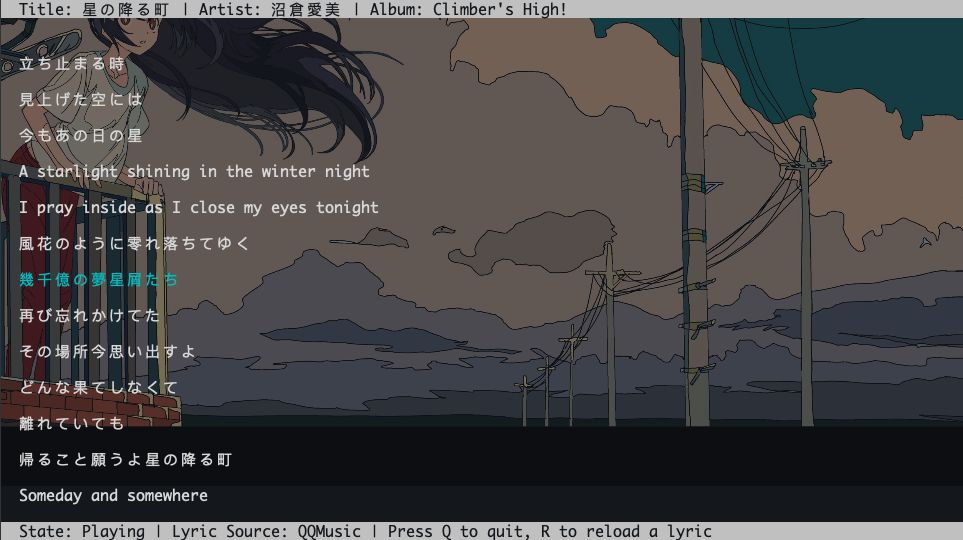

# lyricsx-cli

[](https://github.com/ddddxxx/lyricsx-cli/actions)

[LyricsX](https://github.com/ddddxxx/LyricsX) cross platform command line interface.

## Dependences

### macOS

No additional dependencies required.

### Linux

- [playerctl](https://github.com/altdesktop/playerctl)

## Usage

### Search

```
$ lyricsx-cli search <keyword>
```

### Tick

```
$ lyricsx-cli tick
```

### Play

```
$ lyricsx-cli play [--color <color>] [--no-bold]
```

#### Keyboard actions

| KEY       | ACTION          |
|-----------|-----------------|
| `[Q]`     | *Q*uit          |
| `[R]`     | *R*eload lyrics |
| `[space]` | Play or pause   |
| `[,]`     | Previous track  |
| `[.]`     | Next track      |


#### Snapshots


